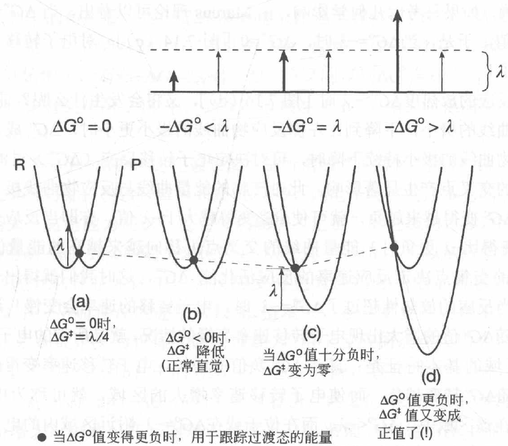

# Marcus理论
Marcus理论定量（存疑，我觉得这更像是一个模型体系的定量描述）描述了溶剂中电子转移反应的反应速率。
$\Delta G^{o}$表示反应物和产物的势能曲线上极小值点的差（反应物减产物），这个量叫做反应的热力学自由能。$\Delta G^{\ddagger}$表示反应物到产物的能垒。

---

上面是Marcus的结论，下面先介绍一些热力学的知识，再详细介绍Marcus理论。